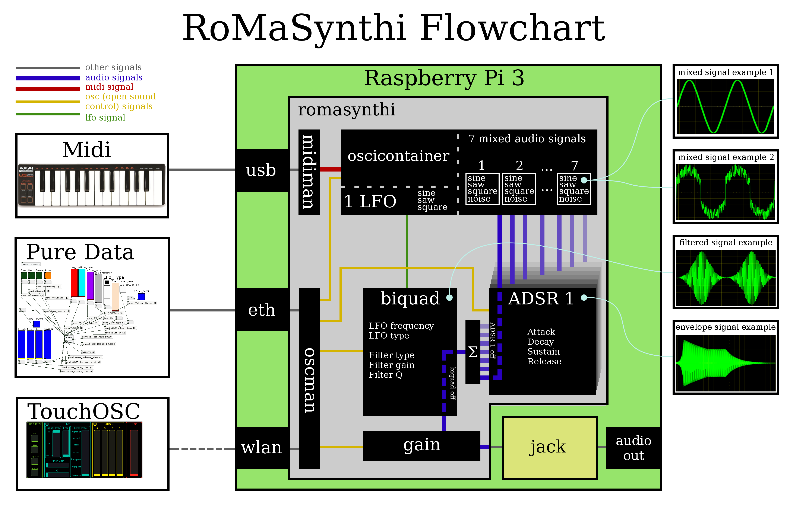

# RoMaSynthesizer :musical_keyboard:
The RoMaSythesizer is a polyphone software synthesizer written in C++, which generates sound 
in a combination of additive and subtractive synthesis. The software is part of 
a project at [TU Berlin](http://www.ak.tu-berlin.de) in the seminar 
[Klangsynthese](https://gitlab.tubit.tu-berlin.de/henrikvoncoler/Klangsynthese_PI). 
This software is designed to run on the [Raspberry Pi 3](https://www.raspberrypi.org/products/raspberry-pi-3-model-b/) 
with a costum [Arch Linux](https://www.archlinux.org/) distribution. If you want
to use this software yourself, make sure you read the requirement and installation 
section carefully. The following flowchart gives an overview of the implementation.

<p align="center">
    
</p>

# Requirements
## Library
The following external librarys are needed to compile the senthesizer onto your 
system:  
* [liblo](http://liblo.sourceforge.net/)
* [jackcpp](https://github.com/x37v/jackcpp)
* [rtmidi](https://www.music.mcgill.ca/~gary/rtmidi/index.html#download)

## Jack
A [Jack](http://www.jackaudio.org/) audio server is fundamental to run the 
synthesizer. Make sure you have a solid jack audio environment running. The 
buffer size we use on the Raspberry Pi is ```256```
and the sample rate is ```48kHz```. This might differ 
from your system and you are free to find the right jack settings.

## Open Sound Control
The RoMaSynthesizer can be controlled via OSC. We use the app [TouchOSC](https://hexler.net/software/touchosc) by 
Hexler, which is available in the Android and iOS Appstores.
Alternativley the [Pure Data](https://puredata.info/downloads/pd-extended) file in ./osc can be used to control the parameters. 
Make sure you have installed pd-extended with the ```mrpeach``` modul included, otherwise 
the pd patch file will not work.

## Midi
To "play" the synthesizer you need a external usb midi keyboard, which is shown in 
the flowchart, or you can connect in jack a software midi keyboard like the 
[Cadence-XY Controller](http://kxstudio.linuxaudio.org/Applications:Cadence-XYController).

# Installation
To install the software, make sure you fulfill the requirements and follow the 
next steps.

* Download / Clone the Repository:
```javascript
    git clone git@gitlab.tubit.tu-berlin.de:markus.wende/RoMa_Synthesizer_One.git
```
* (Optional) if you downloaded as a .zip file, unzip the archiv

* Go into the folder:
```javascript
    cd RoMa_Synthesizer_One*
```
* Compile the source code:
```javascript
    make
```

# Usage
If you want to start the synthesizer, make sure you are in the folder you 
compiled it. If you want global access to the synthesizer you have to add the 
program to your PATH variable. In the terminal type: 
```javascript
    export PATH=$PATH:/path/to/my/RoMaSynthi
```
And make sure you changed the path to the right one. 

Now you can run the synthesizer from the command line by:

```javascript
    RoMaSynth
```

If you have exported the program to your PATH, or by:

```javascript
    ./RoMaSynth
```

If you are still in the compile directory. If everything works fine you should 
see something similar to:

```javascript
    fs: 48000 Hz || buffer size: 512 samples
    Started OSC Server!
    Started Midi Server!
    
```

The senthesizer is now running and ready to be connected with pd-extended 
or TouchOSC. Check your jack connections and connect in jack the midi controller 
to the RtMidi Input Client. Now you are ready to rock. Have fun! :)